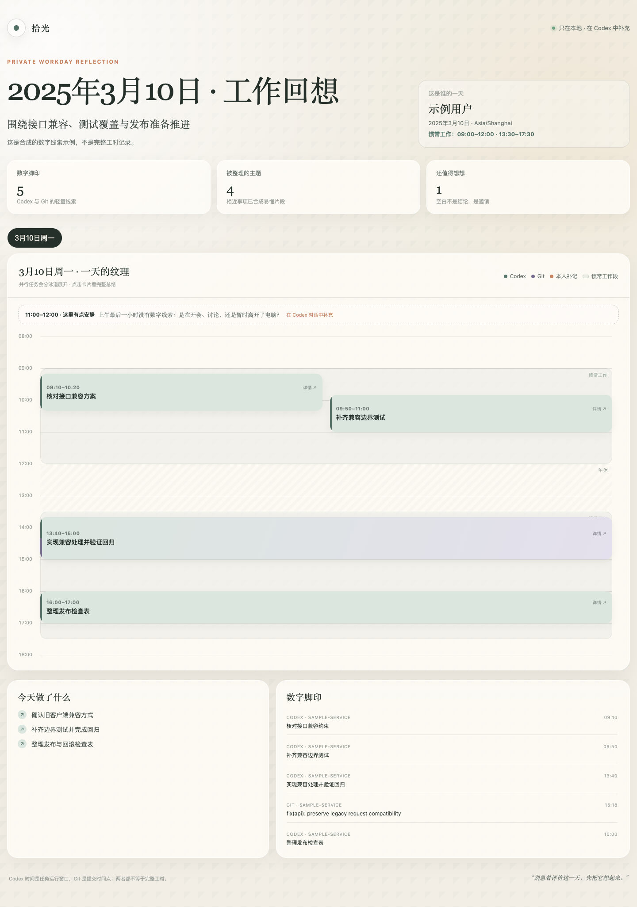
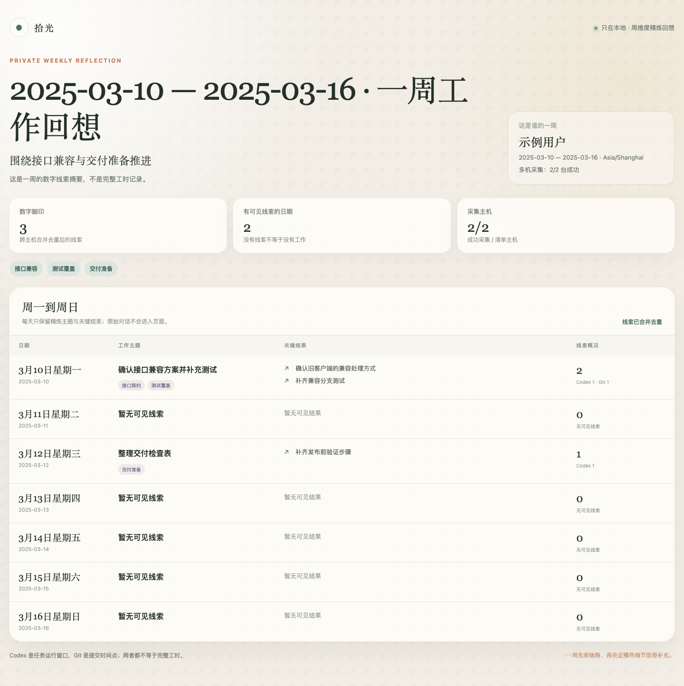

# Reflect Workday

**写周报前，先找回这一周做过什么。**

Reflect Workday 是一个 Codex Skill，适合工作分散在多个任务、项目或开发机上的人。它把精简的 Codex 与 Git 线索整理成每日时间线或每周回顾，再由你补充会议、思考和其他没有数字记录的工作。

**[先生成示例报告](#demo)** · [安装与使用](#install) · [English](README.en.md) · [隐私设计](docs/privacy.md)

Python **3.9+** · 核心脚本零第三方依赖 · 本地 HTML 报告 · [MIT](LICENSE)

> 它提供的是“可见线索 + 本人回想”，不是精确工时，也不用于绩效评价。

你可以用它：

- **回顾昨天**：把多个 Codex 任务与 Git 提交放回同一条时间线。
- **整理周报素材**：生成最近 7 天或周一到周日的主题与关键结果。
- **汇总多台开发机**：通过已授权的 OpenSSH 主机采集精简线索，在本地合并去重。

<a id="demo"></a>
## 先生成一份示例报告

只需 Python 和 Git。这个演示使用仓库自带的合成数据，不需要安装 Skill、读取工作记录或连接远端主机。

```bash
git clone https://github.com/rzr002/reflect-workday.git
cd reflect-workday
python3 scripts/render_report.py \
  --evidence examples/daily/evidence.json \
  --reflection examples/daily/reflection.json \
  --template assets/reflection.html \
  --output /tmp/reflect-workday-daily.html
```

用浏览器打开 `/tmp/reflect-workday-daily.html`，即可查看下面的单日时间线。准备回顾自己的工作时，继续[安装与使用](#install)。

## 效果展示

### 单日时间线

同一时间运行的任务会分泳道展示；页面只读，补记通过 Codex 对话完成。



### 自然周表格

周报固定展示周一到周日，每天只保留精炼主题和关键结果。



截图全部由合成示例数据生成，不包含真实用户、主机或工作记录。

## 能做什么

- 生成单日只读时间线，并区分真实并行任务。
- 生成“最近 7 天”滚动回顾或周一到周日的自然周表格。
- 合并多台开发机的 Codex 与 Git 线索，并在本地去重。
- 只保留任务首行、结果首句、时间、项目短名和 commit subject。
- 明确标出没有可见线索的日期，不擅自推断为休息或没有工作。
- 生成无网络依赖的单文件 HTML，方便本地查看和归档。

## 隐私原则

Reflect Workday 不会读取或保存：

- SSH 密码、动态码、令牌或私钥；
- Shell 历史；
- 完整 Codex 对话、推理、工具输出或代码正文；
- 未经用户批准的远端主机。

远端采集通过 OpenSSH 执行临时只读脚本。原始 session 留在远端，只返回裁剪后的 `evidence.json`。详细边界见 [docs/privacy.md](docs/privacy.md)。

## 要求

- Codex 桌面端或支持 skills 的 Codex 环境
- Python 3.9 或更新版本
- Git（仅在需要 Git 线索时）
- OpenSSH（仅在需要多机采集时）
- Node.js 与 Playwright（仅用于开发阶段的布局检查）

核心采集与渲染脚本只使用 Python 标准库。

<a id="install"></a>
## 安装

如果尚未运行上面的演示，先克隆仓库：

```bash
git clone https://github.com/rzr002/reflect-workday.git
cd reflect-workday
```

在 macOS / Linux 上，把仓库根目录软链接到个人 Skills 目录。以下命令在目标已存在时仅显示现有路径，供你检查：

```bash
mkdir -p "$HOME/.agents/skills"
if [ -e "$HOME/.agents/skills/reflect-workday" ] || [ -L "$HOME/.agents/skills/reflect-workday" ]; then
  ls -ld "$HOME/.agents/skills/reflect-workday"
else
  ln -s "$PWD" "$HOME/.agents/skills/reflect-workday"
fi
```

保留克隆目录，软链接会持续指向它。若已安装另一个版本，确认其来源和本地修改后再决定如何替换。

重启 Codex 后即可使用 `$reflect-workday`。

## 快速开始

### 回顾昨天

```text
使用 $reflect-workday 回顾我昨天做了什么，生成只读时间线。
```

首次生成日时间线时，skill 会询问你的惯常工作时段，以免把午休或非工作时间误判为待补记空白。

### 生成上周周报

```text
使用 $reflect-workday 汇总我上周周一到周日的工作，生成一张精炼的大表格。
```

自然周报告不需要工作时段配置。每天最多三个主题和三个关键结果。

### 汇总多台机器

复制示例清单：

```bash
cp hosts.example.json hosts.local.json
```

只填写 OpenSSH 别名和远端扫描路径，不要写密码、IP、令牌或私钥。然后在 Codex 中请求：

```text
使用 $reflect-workday 汇总 hosts.local.json 中多台机器的上周工作线索。
```

skill 会先展示只读执行计划。只有你明确确认后才会连接远端。密码认证应在可见终端中由 OpenSSH 处理，后台采集使用 `BatchMode=yes`。

## 本地示例

单日报告见[示例演示](#demo)。以下命令在已克隆的仓库目录中运行。

生成合成数据的周报：

```bash
python3 scripts/render_weekly_report.py \
  --evidence tests/fixtures/weekly-evidence.json \
  --reflection tests/fixtures/weekly-reflection.json \
  --template assets/weekly-reflection.html \
  --output /tmp/reflect-workday-weekly.html
```

## 仓库结构

```text
.
├── SKILL.md                 # skill 工作流与安全约束
├── agents/                  # Codex 展示配置
├── assets/                  # 日报与周报 HTML 模板
├── docs/                    # 架构、隐私与截图
├── examples/                # 仅含合成数据的示例
├── references/              # evidence 与 reflection 数据契约
├── scripts/                 # 采集、合并、渲染和布局检查
├── tests/                   # 单元测试和合成 fixtures
└── hosts.example.json       # 无真实地址的多机配置示例
```

## 开发与验证

运行全部 Python 测试：

```bash
PYTHONDONTWRITEBYTECODE=1 python3 -m unittest discover \
  -s tests -p 'test_*.py' -v
```

布局检查需要 Playwright：

```bash
npm install --save-dev playwright
npx playwright install chromium

node scripts/check_browser_layout.js /tmp/reflect-workday-daily.html /tmp/daily.png
node scripts/check_weekly_layout.js /tmp/reflect-workday-weekly.html /tmp/weekly.png
```

## 已知边界

- Codex 时间段是 agent 运行窗口，不代表用户持续工作。
- Git commit 是时间点，不能据此推算编码时长。
- 标题本身仍可能含业务信息；生成的报告和 `evidence.json` 应默认视为私人文件。
- 没有数字线索可能代表会议、沟通、思考、休息，或只是尚未想起。

## 参与贡献

欢迎修复问题、补充测试或改进模板。提交前请阅读 [CONTRIBUTING.md](CONTRIBUTING.md)，尤其是其中的隐私检查清单。

安全问题请按 [SECURITY.md](SECURITY.md) 说明私下报告，不要在公开 issue 中粘贴日志、凭据或真实工作记录。

## 许可证

[MIT](LICENSE)

## 相关项目

- 想把工作中有效的方法沉淀成 Wiki 和 Skill：[WorkSkill](https://github.com/rzr002/workskill)。
- 想组织和调用已有的个人、团队 Skills：[Personal Workbench](https://github.com/rzr002/personal-workbench)。

三个项目可以独立使用，目前没有自动传递报告或个人记录的集成。
