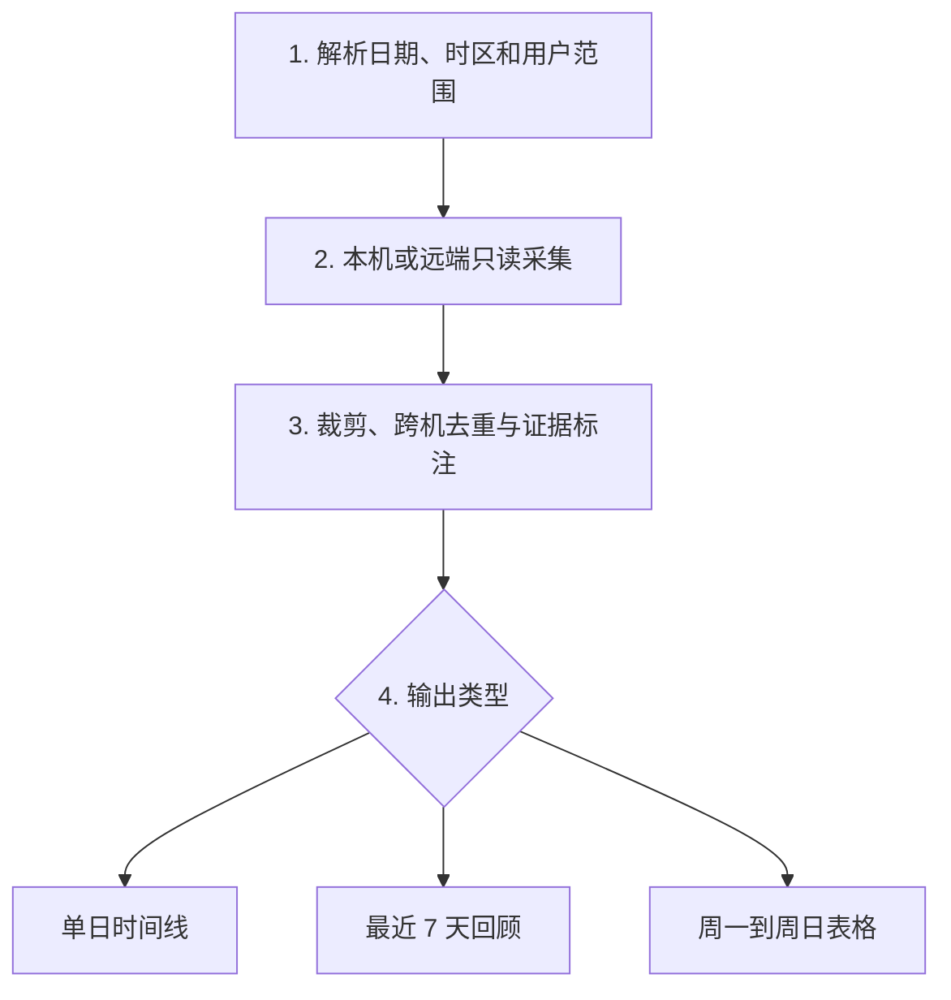

# 工作原理

Reflect Workday 把流程拆成四个边界清晰的阶段。

## 1. 范围解析

skill 把“昨天”“最近 7 天”和“上周”转换成带 IANA 时区的半开区间 `[start, end)`。自然周固定从周一 00:00 到下周一 00:00。

## 2. 采集

`scripts/collect_activity.py` 扫描指定日期范围内的 Codex session 与 Git 元数据。它只输出短线索，不输出原始会话。

多机模式由 `scripts/collect_multi_host.py` 调度：

1. 读取只含 SSH 别名和扫描路径的 manifest；
2. 先打印计划，不连接主机；
3. 用户确认后使用 `BatchMode=yes` 执行；
4. 单台失败时继续其他主机；
5. 全部失败时停止渲染。

## 3. 去重

- Codex 事件按稳定事件 ID 合并。
- Git 事件按仓库指纹与 commit hash 组合去重。
- 合并后只保留匿名 `host_ids`，不写 SSH 别名或路径。

数据结构见：

- [evidence contract](../references/evidence-contract.md)
- [daily reflection contract](../references/reflection-contract.md)
- [weekly reflection contract](../references/weekly-reflection-contract.md)
- [remote manifest contract](../references/remote-manifest-contract.md)

## 4. 渲染

日报和周报模板位于 `assets/`。渲染器把经过转义的 JSON 嵌入单文件 HTML，不访问网络，也不依赖后端服务。

日报支持并行泳道和详情弹窗；周报固定七行，并在移动宽度下切换为卡片。两种页面都不提供浏览器内补记、导入或导出入口。
