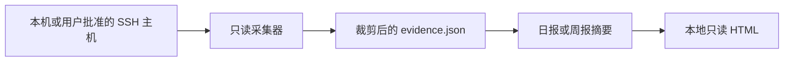

# 隐私设计

Reflect Workday 的目标不是收集更多数据，而是用尽量少的数字线索帮助用户回想工作。

## 数据流



远端执行时，采集器通过 SSH stdin 临时传入，不需要保存到远端磁盘。远端 stdout 只返回裁剪后的 JSON。

## 会采集什么

- Codex 任务首个有效文本行；
- assistant 最终结果的首个有效文本行；
- 任务开始与结束时间；
- 项目目录的短名；
- Git commit subject、时间和不可逆仓库指纹；
- 多机合并使用的匿名 `host_id`。

## 不会采集什么

- 完整对话、推理或子代理文本；
- 工具输出、代码正文或文件内容；
- Shell 历史；
- 密码、动态码、令牌、私钥或 Cookie；
- SSH 别名、真实主机名、IP 或远端绝对路径；
- 未经用户明确批准的远端主机。

## 认证边界

密码认证只能由用户在可见终端中交给 OpenSSH。后台调度使用 `BatchMode=yes`，只能复用已经建立的连接，不会弹出、读取或记录密码。

主机清单出现 `password`、`token`、`secret`、`private_key` 等字段时，采集器会拒绝整个清单。

## 输出仍然是私人数据

`evidence.json`、`reflection.json`、周报、日报和截图仍可能包含工作标题、项目短名、Git author 或 commit subject。它们默认不适合公开发布。

仓库的 `.gitignore` 会忽略常见输出名，但这不是安全边界。公开前仍应人工检查 staged files：

```bash
git diff --cached --name-only
git diff --cached
```

## 不做的推断

- Codex 运行窗口不等于用户持续工作时间。
- Git commit 不代表编码时长。
- 没有线索不等于休息、摸鱼或没有工作。
- 报告不用于绩效评分。

## 建议的公开示例

只使用合成的姓名、项目、commit 和日期。仓库中的 `examples/`、`tests/fixtures/` 与 `docs/images/` 均应满足这一要求。
